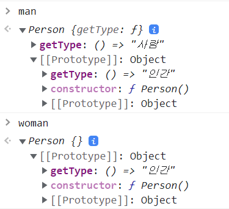
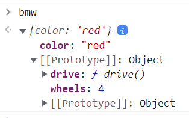
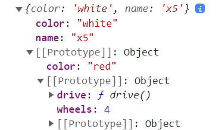

# [호이스팅(나무위키 참조)](https://namu.wiki/w/%ED%98%B8%EC%9D%B4%EC%8A%A4%ED%8C%85)
## 정의 `변수의 선언과 초기화를 분리`
 변수의 정의가 그 범위에 따라 선언과 할당으로 분리되어 변수의 선언을 항상 컨텍스트 내의 최상위로 끌어올리는 것을 의미한다. 이는 오로지 변수에만 해당되는 것은 아니고 함수도 가능하며, 자바스크립트에서 함수의 호출을 첫 줄에서 하고 마지막 줄에 함수를 정의해도 문제없이 작동되도록 하는 유용한 특성이다.
 아래와 같은 코드가 있을 경우 
```js
function sum (a, b) {
  var x = add(a,b);
  return x;

  function add (c, d) {
    var result = c+d;
    return result;
  }
}
```
자바스크립트는 아래와 같이 해석한다.

```js
function sum (a, b) {
  // 선언 부분을 위로 끌어 올린다.
  var x = undefined;
  function add (c, d) {
    var result = c+d;
    return result;
  }

  // 정의 부분을 실행한다.
  x = add(a,b);
  return x;
}
```
## `var` vs `let`

아래 코드를 실행 시켜보자
```js
console.log(name1)
var name1 = 'DK'
```
호이스팅으로 인해 에러 없이 실행되지만 `undefined`로 나오는 정상적인 코드는 아니다.
아래의 코드를 실행해보자
```js
console.log(name2)
let name2 = 'DK'
```
```
Uncaught ReferenceError: Cannot access 'name2' before initialization
```
이와 같이 에러 메시지가 출력된다. 

`var`와 `let`의 차이는 호이스팅 방법에 있다. 두 방법 모두 스코프 내부 어디에서든 변수 선언이 최상위에 선언된 것처럼 행동한다. 그러나 `var` 는 `undefined`로 초기화가 되어서 에러가 나지 않는 것이고 `let` 은 아무런 값도 할당하지 않고, 할당 후 사용할 수 있다. 값을 할당 하기 전에 사용하면 에러메시지가 출력된다.
> 선언부터 할당하기 전까지를 변수 사용을 못하는 구간을 TDZ(Temporal Dead Zone)라고 한다.


```js
var number = 7

function showNumber() {
    console.log(number)
    var number = 14
    console.log(number)
}

showNumber()
```


```js
let number = 7

function showNumber() {
    console.log(number)
    let number = 14
    console.log(number)
}
showNumber()
```
위 두개의 실행결과는 어떻게 나올까??

.

.

.

.

.

.

.

.

.

.

```
undefined
14
```
```
Uncaught ReferenceError: Cannot access 'number' before initialization
```
`var`를 사용한 코드는 인터프리터에서 실제로는 아래처럼 실행된다.

```js
var number = 7

function showNumber() {
    var number = undefined // 블럭안에서 호이스팅이 일어나서 선언부분이 위로 올라온다.
    console.log(number)
    number = 14            // 정의부분만 남는다. (원래 var number = 14였던 코드)
    console.log(number)
}
showNumber()
```

이런 호이스팅의 부작용으로 ES6 이후 var를 대체하여 let을 사용하고 있다.(우리만 빼고)

## const

```js
let name // 문제 없음
name = "Hello"

var name1 // 문제 없음
name1 = "Hello"

const name2 // Uncaught SyntaxError: Missing initializer in const declaration
name2 = "hello"
```
`const`는 `선언 + 초기화 + 할당`이 한 번에 일어나야 된다.

## 스코프
- var : 함수 스코프, 함수 내 어디서든 사용가능하다.
```js
for(var i = 0; i < 10; i ++) {}
console.log(i)

if(true){
    var name = 'hello'
}
console.log(name)

```
- let, const : 블록 스코프, 블록을 벗어나면 사용 불가능하다.
```js
for(let i = 0; i < 10; i ++) {}
console.log(i)

if(true){
    let name = 'hello'
}
console.log(name)
``` 

## 정리
버그와 부작용을 줄이기 위해 `var` 보다는 `let`과 `const`를 사용하자.

---
# 함수
```js
function add(a, b) {
    return a + b
}
console.log(add(3, 5))

const sub = function(a, b) {
    return a - b;
}
console.log(sub(3, 5))

const mul = (a, b) => {
    return a * b
} 
console.log(mul(3, 5))

const sq = a => a * a
console.log(sq(3))
```

---
# object

## 객체 리터럴
```js
let name = "yesman"
let age = 30

let obj = {
    "name": name,
    age, // age: age에서 생략함
    "yesman":"yes",
    answer: function() {
        console.log('yes!!');
    },
    doSomething() {
        console.log('oh~ yes!! ')
    },
    "isOk": ()=>console.log('yeah~~s!! '),

}
console.log('name : ', obj.name)
console.log('name : ', obj["name"])
console.log('obj[name] : ', obj[name])
console.log('age :' + obj["age"])
console.log('age :' + obj[age])
obj.answer()
obj["answer"]()
obj[answer]() 
```
실행결과
```
name :  yesman
name :  yesman
obj[name] :  yes
age :30
age :undefined
yes!!
yes!!
Uncaught ReferenceError: answer is not defined 
```
## 생성자 함수
생성자 함수는 `new` 키워드로 생성한다.
### 기본사용
```js
function User(name, age) {
  this.name = name
  this.age = age
}

let user1 = new User('Hi', 30)
let user2 = new User('안녕', 30)
let user3 = new User('방가', 30)

console.log(user1)
console.log(user2)
console.log(user3)
```

### 맴버 추가
```js
function User(name, age) {
  this.name = name
  this.age = age
  this.sayName = function() {
    console.log(`저의 이름은 ${this.name} 입니다.`)
  }
}
let user1 = new User('Hi', 30)
user1.sayName()
```


## Computed property

```js
let a = 'a'

const user = {
  name : 'Hi',
  [a + 'ge'] : 30, // computed property [ ] 기호 안에 연산할 내용을 적는다.
  [1 + 2 ] : 3
}
```
## Object 객체
### 키/값 <--> 배열 변환
```js
let a = 'a'
let nameString = 'name'

const user = {
  [nameString] : 'Hi', // computed property
  [a + 'ge'] : 30,  
  [1 + 2 ] : 3
}
// Key/Value를 Array로 변환
userArr = Object.entries(user)
console.log(userArr)

// Array를 Key/Value로 변환
userKeyValue = Object.fromEntries(userArr)
console.log(userKeyValue)

```

```
▼(3) [Array(2), Array(2), Array(2)]
 ▶0: (2) ['3', 3]
 ▶1: (2) ['name', 'Hi']
 ▶2: (2) ['age', 30]
   length: 3
 ▶[[Prototype]]: Array(0)

▼{3: 3, name: 'Hi', age: 30}
   3: 3
   age: 30
   name: "Hi"
 ▶[[Prototype]]: Object
```
### Object.assign() 복사

```js
const user = {
  name: "hi",
  age : 20
}

const copyUser = Object.assign({}, user)
copyUser.name = "bye"
console.log(user)
console.log(copyUser)
```

```
{name: 'hi', age: 20}
{name: 'bye', age: 20}
```

### Object.keys() 키 추출, Object.values() 값 추출

```js
const user = {
  name: "hi",
  age : 20
}

const keys = Object.keys(user)
const values = Object.values(user)
console.log(keys)
console.log(values)
```

```
['name', 'age']
['hi', 20]
```

# Array
## 기초
- push()
- pop()
- unshift() 앞에 삽입
- shift()  뒤에 삭제
## 심화구문
### Array.splice()
지정된 요소를 지우고, 필요에 따라 요소를 추가 한다. 지워진 요소는 리턴값으로 반환한다.
- arr.splice(시작, 개수) : 특정요소 지움
- arr.splice(시작, 개수, `추가요소`) : 지우고 `추가요소` 추가


```js
let arr = [1, 2, 3, 4, 5]
let result = arr.splice(1, 2) // [2, 3] 지움
console.log(arr) // [1, 4, 5]
console.log(result) // [2, 3]
```
```js
let arr = [1, 2, 3, 4, 5]
let result = arr.splice(1, 3, 100, 200) // [2, 3, 4] 지움, [100, 200] 추가
console.log(arr) // [1, 100, 200, 5]
console.log(result) // [2, 3, 4]
```
```js
let arr = [1, 2, 3, 4, 5]
let result = arr.splice(1, 0, 100, 200) // 지울게 없네, [100, 200] 추가
console.log(arr) // [1, 100, 200, 2, 3, 4, 5]
console.log(result) // []
```
### Array.slice()
- arr.slice(n, m) : n번째 부터 m번째 까지 반환 (m을 안쓰면 마지막까지, 전부 안쓰면 전체 복사)

```js
let arr = [1, 2, 3, 4, 5]
console.log(arr.slice()) // [1, 2, 3, 4, 5]
console.log(arr.slice(1)) // [2, 3, 4, 5]
console.log(arr.slice(1, 4)) // [2, 3, 4]
```
### Array.concat()
- arr1.concat(arr2, arr3, ...) : 배열들을 합쳐서 하나의 새 배열로 생성

```js
let arr1 = [1, 2]
let arr2 = [3, 4]
const newArray = arr1.concat(arr2, [5, 6], 7, 8)
console.log(newArray) // [1, 2, 3, 4, 5, 6, 7, 8]
```

### Array.forEach(fn) : 배열 반복

```js
let array = "my name is hi".split(" ")

array.forEach((item, index, arr) => {
  // arr은 해당 배열 자체이고 보통 생략한다.
  console.log(`${index} : ${item}`)
})
```

### Array.indexOf() / Array.lastindexOf()

```js
let arr = [1, 2, 3, 4, 5, 1, 2, 3]

arr.indexOf(3) // 2 
arr.indexOf(3, 3) // 7, 인덱스 3 이후의 3을 찾아 인덱스를 알려준다.
arr.lastIndexOf(3) // 7, 뒤에서 3을 찾아서 인덱스를 리턴한다.
```


### Array.includes()  : 포함 확인
배열내 있으면 true 리턴, 없으면 false
```js
let arr = [1, 2, 3]

console.log(arr.includes(2)) // true
console.log(arr.includes(8)) // false
```

### Array.find(fn)/ Array.findIndex(fn) 
첫번째 true 값/인덱스만 반환하고 끝, 찾지 못하면 undefined를 반환, fn은 찾는 함수이다.
배열내 있으면 true 리턴, 없으면 false
```js
let arr = [1, 2, 3, 4, 5, 6, 7, 8, 9]

const result = arr.find((item) => item%2 === 0)
// same
const result1 = arr.find((item) => {return item%2 ===0})
// same
const result2 = arr.find(function(item) {
  return item % 2 === 0
})
console.log(result) // 2
```


### Array.filter(fn)
find()와 기능이 유사하지만 find()는 하나만 찾는데 반해 filter()는 조건을 만족하는 모든 값을 배열로 만들어 리턴한다.
```js
let arr = [1, 2, 3, 4, 5, 6, 7, 8, 9]

const result = arr.filter((item) => item%2 === 0)

console.log(result) // 2
```

### Array.reverse() : 역순으로 정렬 (실제 값의 위치가 바뀐다)

### Array.map(fn)
함수를 받아 특정 기능을 수행 후 새로운 배열을 반환

```js
let arr = [1, 2, 3, 4, 5]

const result = arr.map((item) => item%2 === 0)
console.log(result) // [false, true, false, true, false]
const result2 = arr.map((item) => item*item)
console.log(result2) // [1, 4, 9, 16, 25]
```

### Array.join()
문자열을 합쳐준다. join()함수 안에 넣은 문자열로 합쳐주며, 아무것도 넣지 않으면 콤마로 각 문자열을 합쳐준다.
```js
let arr = ["안", "녕", "하", "세", "요"]
console.log(arr.join()) // 안,녕,하,세,요
console.log(arr.join("|")) // 안,녕,하,세,요
console.log(arr.join("")) // 안녕하세요
```

### Array.isArray()
객체가 배열인지 판별한다.
```js
let user = {
  name: "hi",
  age: 20
}

let arr = ["hi", 20]

console.log(typeof user) // object
console.log(typeof arr)  // object
console.log(Array.isArray(user))  // false
console.log(Array.isArray(arr))   // true
```

### Array.sort(fn) / Array.reduce()
```js
let arr = [12, 5, 2, 4, 3]
arr.sort();
console.log(arr) // [12, 2, 3, 4, 5] ??? 문자열로 인식하고 정렬한다.
```
sort()함수는 인자로 값 비교 함수를 넣지 않으면 값을 문자열로 인식하고 정렬한다. 숫자를 정렬하기 위해서는 비교 함수를 넣어주자.

```js
let arr = [12, 5, 2, 4, 3]
let sortFunc = (a, b) => a - b // 음수, 0, 양수로 구분된다.
/*
let sortFunc = function (a, b) {
  return a - b 
}
*/
arr.sort(sortFunc);
console.log(arr) // [2, 3, 4, 5, 12]
```

### Array.reduce()
reduce() 메서드는 배열의 각 요소에 대해 주어진 리듀서(reducer)함수를 실행하고, 하나의 결과값을 반환한다.

```js
let arr = [1, 2, 3, 4, 5]

// prev : 이전까지의 처리 결과 (여기서는 이전까지의 누적합)
// cur : 현재값
// 마지막 인자 0 : 초기값
const result = arr.reduce((prev, cur) => { 
  return prev + cur
}, 0)
console.log(result) // 15
```

```js
function balancedParens(string) {
    // [].reduce
    // (method) Array<undefined>.reduce(callbackfn: (previousValue: undefined, currentValue: undefined, currentIndex: number, array: undefined[]) => undefined): undefined (+2 overloads)
    return !string.split("").reduce(function(acc, char) {
        if(char === "(") { return ++ acc}
        if(char === ")") { return -- acc}
        return acc;
        
    }, 0)
}

console.log(balancedParens("()))")) // false
console.log(balancedParens("((ddafd(dddd)44ddfgas))")) // true

const numbers = [1, 1, 1, 2, 3, 4, 5, 12, 3 ,3 , 3, 4, 5, 2]
let mapReduce = numbers.reduce((map, number) => {
   if(map[number] === undefined) map[number] = 0
   map[number] ++
   return map
}, {})

console.log(mapReduce) // {1: 3, 2: 2, 3: 4, 4: 2, 5: 2, 12: 1}
```
---
# 구조분해 할당

## 배열 구조 분해
```js
let str = "my name is hi"
// 변수 개수가 남는 경우
let [word1, ,word2] = str.split(' ')
console.log(`${word1}, ${word2}`) // my, is

// 변수 개수가 모자라는 경우
let [a, b, c] = [1, 2] // c는 undefined로 초기화 된다.
console.log(`${a}, ${b}, ${c}`) // 1, 2, undefined

// 초기값 지정
let [d=1, e=2, f=3] = [4, 5]
console.log(`${d}, ${e}, ${f}`) // 4, 5, 3
```

## 객체 구조 분해

```js
{
let user = {name: 'hi', age:20}
let {name:myName, age, gender = 'male'} = user // gender는 디폴트값
console.log(`${myName}, ${age}, ${gender}`) // hi, 20, male
}
```

## 나머지 매개변수, 전개구분
### 나머지 매개변수(Rest parametes)
아래는 예전 arguments를 사용하는 방식으로 기능에 제약이 많아(forEach, map 등을 사용 할 수 없음) 지금(es6 이후)은 잘 사용되지 않는다. 
```js
function showName(name) {
  console.log(name) // Hi
  console.log(arguments.length) // 2
  console.log(arguments[0]) // Hi
  console.log(argumnets[1]) // error: Uncaught ReferenceError: argumnets is not defined
}
showName('Hi', 'Hello')
```
나머지 매개변수를 사용한 방법은 아래와 같다.
```js
function showName(...names) {
  console.log(names) // Hi
  names.forEach((name) => console.log(name))
}
showName('Hi', 'Hello')
showName(1,2,3,4,5,6,7,8,9,10)
```
나머지 매개변수는 배열로 들어오기 때문에 배열에 모든 기능을 사용할 수 있어 편리하다. 우리도 사용하자.


```js
function User(name, age, ...skills) { // 가장 마지막에만 나머지 매개변수를 쓸 수 있다.
  this.name = name
  this.age = age
  this.skills = skills
}

const user1 = new User('hi', 20, 'English', 'java')
const user2 = new User('son', 20, 'c/c++', 'java', 'go')
const user3 = new User('kane', 20, 'cook', 'run')
console.log(user1)
console.log(user2)
console.log(user3)
```
나머지 매개변수를 쓸때 유의점은 나머지 매개변수는 가장 마지막 매개변수에만 사용이 가능하다.

### 전개구분(spread)
전개 구문은 객체나 배열을 펼칠수 있게 해준다.
쉽게 얘기 해서 `[]`, `{}`를 벗기고 내용물을 대입한다고 생각하면 된다. 
> 이 때 데이터는 풀어지면서 레퍼런스 복사가 아니고 값 복사가 일어난다.
```js
let arr1 = [1, 2]
let arr2 = [3, 4]
const newArr1 = [arr1, arr2, [5, 6], 7, 8]
const newArr2 = [...arr1, ...arr2, ...[5, 6], 7, 8]
console.log(newArr1) // [[1, 2], [3, 4], [5, 6], 7, 8]
console.log(newArr2) // [1, 2, 3, 4, 5, 6, 7, 8]
```


```js
let date = {year:2022, month:3, day:22}
let time = {hour: 9, min:30, sec:17}

const newDatetime1 = {date, time}
const newDatetime2 = {...date, ...time}
console.log(newDatetime1) // {date: {…}, time: {…}}
console.log(newDatetime2) // {year: 2022, month: 3, day: 22, hour: 9, min: 30, sec:17}
```

```js
// 전개구문은 값 복사가 된다.
let user = {name:'hi', age:20}
let copyUser1 = user // 레퍼런스 복사
let copyUser2 = {...user} // 값 복사
console.log(user)
console.log(copyUser1)
console.log(copyUser2)

user.name = "hello"
console.log(user)
console.log(copyUser1)
console.log(copyUser2)
```

# [클로저(Closure)](https://developer.mozilla.org/ko/docs/Web/JavaScript/Closures)
## 어휘적 범위 지정(Lexical scoping)
```js    
function init() {
  let name = "Hi"
  function displayName() {
    console.log(name)
  }
  displayName()
}
init()
```
함수는 실행 될때 자신의 변수를 가지는 환경과, 부모 또는 전역 변수를 참조하는 환경을 가진다. 이를 `Lexical scoping`이라고 한다. 여기서는 `displayName()`에서 부모의 변수를 참조했다.


## 클로저

```js
function makeFunc() {
  let name = "Hi"
  function displayName() {
    console.log(name)
  }
  return displayName
}

var myFunc = makeFunc()
//myFunc변수에 displayName을 리턴함
//유효범위의 어휘적 환경을 유지
myFunc()
//리턴된 displayName 함수를 실행(name 변수에 접근)
```
`displayname()`이라는 함수가 `makeFunc()`함수에 의해 리턴 되어 `myFunc` 변수에 저장되었다. `makeFunc()`에 있는 `name`은 `makeFunc()`의 실행결과로 사라져야 하지만 `name`은 지속적으로 `displayname()`에서 사용 가능하다. 이는 `myFunc`에 할당 될때 `displayname()`이 참조하고 있는 외부 환경과 내부 환경 모두를 가지게끔 자바스크립트에서 클로저를 형성한다.

```js
function makeAdder(x) {
  let y = 1
  return function (z) {
    y = 100
    return x + y + z
  };
}

let add5 = makeAdder(5)
let add10 = makeAdder(10)
//클로저에 x와 y의 환경이 저장됨

console.log(add5(2))  // 107 (x:5 + y:100 + z:2)
console.log(add10(2)) // 112 (x:10 + y:100 + z:2)
//함수 실행 시 클로저에 저장된 x, y값에 접근하여 값을 계산
```
위 예제에서 리턴되어지는 함수의 외부환경은 x, y 변수이고 내부 환경은 z하나만 가진다. 리턴되어질때 x, y 환경이 클로저로 저장된다. 클로저를 사용하여 `add5`와 `add10`은 같은 코드를 공유하지만 다른 어휘적 환경을 저장한다.

```js
function makeCounter() {
  let num = 0;

  return function() {
    return num ++
  }
}
let counter1 = makeCounter()
let counter2 = makeCounter()

console.log(counter1()) // 0
console.log(counter1()) // 1
console.log(counter1()) // 2

console.log(counter2()) // 0
console.log(counter2()) // 1
console.log(counter2()) // 2
```
이 코드를 보면 `makeCounter()`에 의해서 만들어진 클로저는 별개의 환경을 가지는 것을 알 수 있다. 또한 다른 곳에서 num을 변경할 수 없고 오직 함수 호출에 의해서만 변경 시킬 수 있다. (정보은닉)


# prototype, __proto__

## prototype (function인 경우)
프로토타입 객체는 자신이 다른 객체의 원형이 되는 객체이다. 모든 객체는 프로토 타입 객체에 접근할 수 있다.
```js
function Person(){}

Person.prototype.getType = () => "휴먼"

let man = new Person()
let woman = new Person()
console.log(man.getType()) // 휴먼
console.log(woman.getType()) // 휴먼
man.getType = () => "사람"
console.log(man.getType()) // 사람
console.log(woman.getType()) // 휴먼
Person.prototype.getType = () => "인간"
man.getType = () => "사람"
console.log(man.getType()) // 사람
console.log(woman.getType()) // 인간

```


## __proto__ (모든 객체)

```js
let car = {
  wheels: 4,
  drive() {
    console.log(`${this.color}차를 운전하는 기분 좋다.`)
  }
}

const bmw = {
  color: "red"
}

const audi = {
  color: "blue"
}

bmw.__proto__ = car
audi.__proto__ = car
bmw.drive() // red차를 운전하는 기분 좋다.
audi.drive() // blue차를 운전하는 기분 좋다.

console.log(bmw.wheels) // 4
```



```js
let car = {
  wheels: 4,
  drive() {
    console.log(`${this.color}차를 운전하는 기분 좋다.`)
  }
}

const bmw = {
  color: "red"
}

const x5 = {
  color: "white", 
  name : "x5"
}

bmw.__proto__ = car
x5.__proto__ = bmw
x5.drive() // white차를 운전하는 기분 좋다.
console.log(x5) // {color: 'white', name: 'x5'}
for(p in x5) {
    console.log(p) // color name wheels drive
}
```



객체가 직접 가지고 있는 프로퍼티를 구분하려면 hasownProperty()를 사용하면 된다.
```js
for(p in x5) {
    console.log(x5.hasOwnProperty(p), p) 
}
```
---

# class
---

> Lodash
// https://www.youtube.com/watch?v=4_WLS9Lj6n4&t=5845s


git config --global user.email "yoo7032@gmail.com"
git config --global user.name "yoo7032"

# this, call(), apply(), bind()